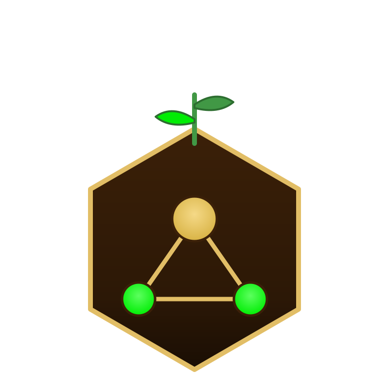

<p align="center">
  
</p>

# seed4j-mcp

A [Model Context Protocol](https://modelcontextprotocol.io) server that exposes [seed4j](https://github.com/seed4j) — an open source application generator — to MCP clients, AI coding assistants, and custom agent hosts.

Instead of a human driving seed4j directly, any MCP-aware client or assistant (Claude Code, Claude Desktop, Cursor, custom IDE integrations, autonomous agents, …) can call the tools below to discover modules, plan a stack, and scaffold a project.

This repo is a **side project of seed4j**, deliberately kept out of the main seed4j repository. The server talks to a running seed4j instance over HTTP — it does not embed seed4j as a library.

## Quick start

You'll need Node.js 20+ and a running seed4j instance (default `http://localhost:1339`). The server is published on npm as [`seed4j-mcp`](https://www.npmjs.com/package/seed4j-mcp); the recommended entrypoint is `npx`:

```bash
# Claude Code (project scope, shared via .mcp.json)
claude mcp add seed4j --scope project -- npx -y seed4j-mcp

# Any other MCP client (JSON config)
# {
#   "mcpServers": {
#     "seed4j": { "command": "npx", "args": ["-y", "seed4j-mcp"] }
#   }
# }
```

Detailed setup per client (scopes, custom `SEED4J_BASE_URL`, global install) lives in [docs/clients.md](docs/clients.md).

## Documentation

Start with [docs/getting-started.md](docs/getting-started.md) if you want to connect the server, verify seed4j is reachable, and run a first tool call.

All documentation lives under [docs/](docs/):

- [docs/README.md](docs/README.md) — documentation entry point with user, operator, and contributor reading paths.
- [docs/getting-started.md](docs/getting-started.md) — install, connect, verify, and try a first MCP flow.
- [docs/overview.md](docs/overview.md) — what the server is, the layers, the STDIO runtime contract.
- [docs/tools.md](docs/tools.md) — every MCP tool exposed today, with inputs/outputs and when to use it.
- [docs/resources.md](docs/resources.md) — read-only MCP resources for the catalogue (modules, landscape, presets).
- [docs/prompts.md](docs/prompts.md) — MCP prompts that encode the curated-stack and custom-stack flows.
- [docs/clients.md](docs/clients.md) — wiring the server into Claude Code, Claude Desktop, Cursor, IDE integrations, and custom MCP hosts.
- [docs/configuration.md](docs/configuration.md) — environment variables and their defaults.
- [docs/errors.md](docs/errors.md) — how failures surface to MCP clients and agents.
- [docs/logging.md](docs/logging.md) — opt-in JSONL debug log (`SEED4J_LOG_FILE`).
- [docs/seed4j-api.md](docs/seed4j-api.md) — verified seed4j HTTP contract.
- [docs/develop.md](docs/develop.md) — local dev setup, tests, STDIO caveat.
- [docs/changelog.md](docs/changelog.md) — what shipped, per roadmap item.
- [docs/ROADMAP.md](docs/ROADMAP.md) — planned improvements.

## License

Apache License 2.0 — see [LICENSE](LICENSE).
